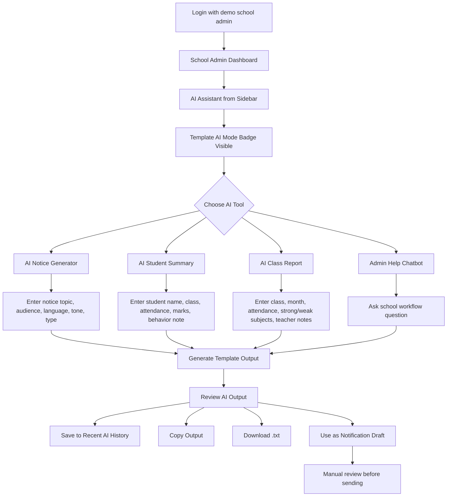

# EducateShala AI Assistant User Flow

This user flow represents the current Day 4 hackathon MVP flow.

## Flow Diagram



## Current MVP Behavior

- The assistant runs in Template AI Mode.
- No external AI provider is required for the demo.
- Generated outputs are drafts and are not sent automatically.
- Recent outputs are saved in AI History.
- Copy and Download actions are available.
- Student and Parent roles are blocked from AI Assistant access.

## Demo Flow Summary

```text
Dashboard → AI Assistant → Choose Tool → Enter Input → Generate Output → Review → Copy / Download / History / Notification Draft
```
